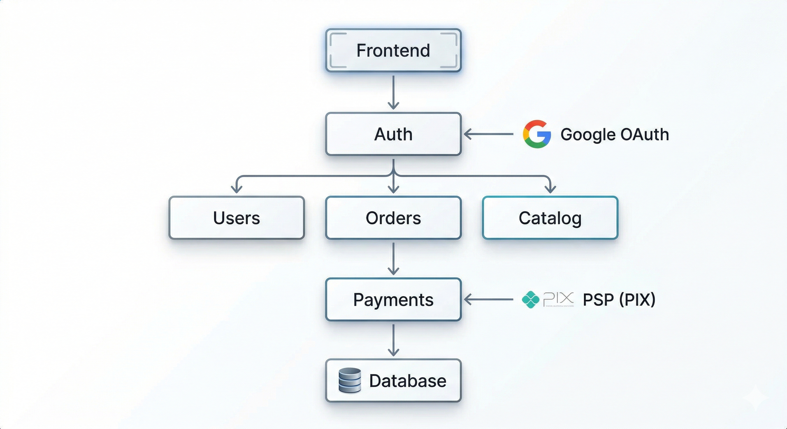

# ADR 02 - Utilizar integração com Google para Auth e com PSP paga pagamentos

## Status: Proposed

## Context

A Arquitetura atual prevê um Módulo de Pagamentos que seria responsável por gerar e gerir todo o fluxo de pagamento; e um Módulo de Autenticação que utilizaria uma senha hash que seria armazenada internamente no próprio banco. Conforme conversa com o Arquiteto J. M. ponderamos a possibilidade de utilizar Google Login.

Também discutimos a utilização de uma ferramenta pronta para gestão de pagamentos e os trade-offs implicados neste Build or Buy.

## Decision

### Adoção de Ferramentas de Mercado

A Arquiteura proposta sofrerá leves ajustes, para implementar Google Auth e um PSP ainda a definir. Ambas as soluções serão utilizadas junto ao Backend da aplicação, que será construído nos moldes da ADR 1 e Architecture Overview. Pela estratégia a ser seguida, adotaremos solução de mercado em áreas estratégicas da solução, com vistas a manter o maior nível de segurança na aplicação.

Build:

- Pedidos
- Conciliação
- Modelo de Dados
- Regras de Negócio

Buy:

- Autenticação (Google)
- Pix (PSP)

O novo fluxo de pagamento ficará da seguinte forma:

Sistema → PSP → Banco → Cliente paga → PSP → Sistema

Sem utilizar o PSP:

- Seria necessário integrar direto com o banco
- Seria necessário lidar com o BACEN
- Seria necessário implementar PIX manualmente
- Seria necessário alocar muito esforço e tempo em segurança

Com a solução de PSP:

- PSP gera a cobrança
- Realiza a liquidação do pagamento
- Notifica o sistema via Webhook
- A segurança das operações fica sob a responsabilidade do provider

Resumindo:

| Conceito            | Quem faz          |
| ------------------- | ----------------- |
| Criar pedido        | Sistema       |
| Gerar PIX           | PSP               |
| Receber dinheiro    | PSP               |
| Confirmar pagamento | PSP → sistema |
| Atualizar status    | Sistema       |

Novo diagrama:

### Simplificação do MVP

Com vistas a reduzir complexidade e aumentar o Time-to-Market, simplificaremos o MVP para entregar mais valor em menos tempo. Os seguintes módulos serão desenvolvidos:

- Google Login
- Pedido
- PIX
- Status

Com a aprovação do MVP, trabalharemos nos módulos seguintes:

- Relatórios
- Painel Admin
- Expiração de Pagamentos

## Consequences

Em primeiro lugar, haverá um ganho substancial na área de segurança da aplicação. As ferramentas de mercado lidam com as principais estratégias de ataques, zelando pela segurança das operações, principalmente quando falamos de operações financeiras, garantindo a efetiva conclusão das transações.

Em contrapartida, adotar soluções de mercado poderá gerar um custo por transação, cobrança de mensalidade  ou prender o time ao fornecedor (lock-in). Diferente de uma solução totalmente criada do zero, cujo custo seria quase zero e o controle seria total.

## Notes

Criado por: Pedro Drumond
Data da criação: 19/03/2026