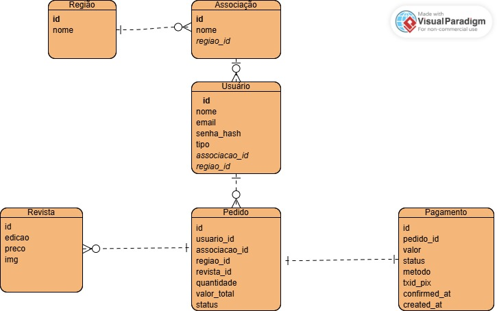
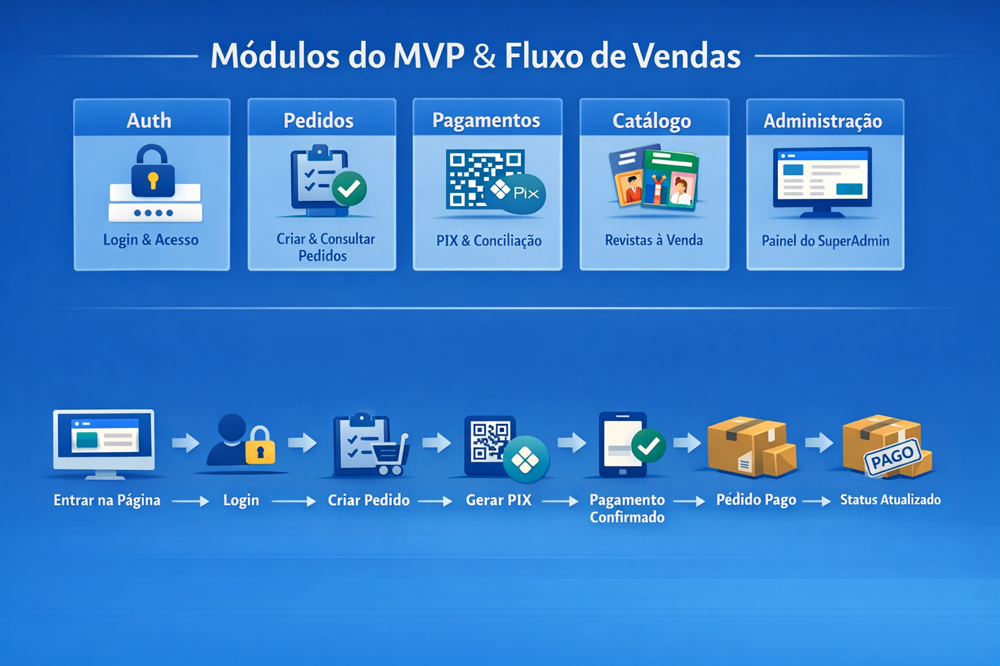
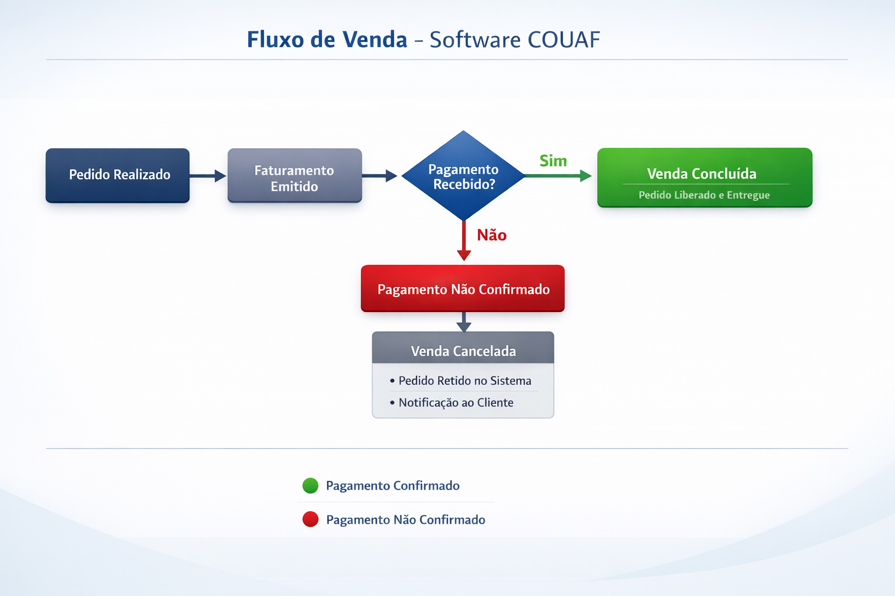

# Arquitetura proposta em Monolito Modular

A arquitetura proposta organiza os componentes por domínio de negócios, não espalhando as mudanças estruturais em diversas camadas e oferecendo as seguintes vantagens:

- Isolamento: mudanças ficam restritas ao componente do domínio específico, facilitando a manutenção.
- Semântica: a implementação reflete o fluxo de trabalho do negócio em vez de camadas técnicas abstratas.
- Evolução: não anula a possibilidade de evolução para microsserviços no futuro.
- Eficiência de custos: adequado ao orçamento proposto.
- Time-to-Market: a falta da sobrecarga de implementar microsserviços permite foco maior na lógica de negócio.

## Diagrama EDR

- Um Usuário pode realizar vários pedidos
- Um Pedido pertence a um único Usuário
- Um Pedido possui exatamente um Pagamento
- Uma Associação pertence a uma Região

## Fluxo da Arquitetura

O fluxo implementado garante rastreabilidade ponta a ponta:

- Usuário acessa o sistema e realiza autenticação

- Usuário cria um pedido (status inicial: PENDENTE)

- Sistema gera uma cobrança PIX vinculada ao pedido

- Usuário realiza o pagamento

- Sistema recebe confirmação via webhook

- Pedido é atualizado automaticamente para PAGO

### Relações principais

- Um Usuário pode realizar vários pedidos  
- Um Pedido pertence a um único Usuário  
- Um Pedido possui exatamente um Pagamento  
- Uma Associação pertence a uma Região  

---

## 🔁 Fluxo da Arquitetura

---

## 🧠 Interpretação do Fluxo

O fluxo implementado garante rastreabilidade ponta a ponta:

1. Usuário acessa o sistema e realiza autenticação  
2. Usuário cria um pedido (**status: PENDENTE**)  
3. Sistema gera uma cobrança PIX vinculada ao pedido  
4. Usuário realiza o pagamento  
5. Sistema recebe confirmação via webhook  
6. Pedido é atualizado automaticamente para **PAGO**  

---

## ⚠️ Cenário alternativo: pagamento não confirmado

Caso o pagamento **não seja realizado**, o sistema mantém consistência através dos estados:

- Pedido permanece como **PENDENTE**  
- Pagamento permanece como **GERADO**  

### 🔧 Melhoria recomendada (pós-MVP)

- Implementar expiração de pagamento (`expires_at`)  
- Atualizar pedido para **CANCELADO** após timeout  

---

## 🧩 Serviços (Módulos) Propostos

A arquitetura é composta pelos seguintes módulos dentro do monólito:

---

### 🔐 Auth

Responsável por autenticação e controle de acesso:

- Registro de usuários  
- Login  
- Geração e validação de tokens (JWT)  
- Proteção de endpoints  

---

### 👤 Users

Responsável pelos dados do usuário:

- Cadastro e manutenção de usuários  
- Associação com Região e Associação  
- Tipos de usuário (ADMIN, SUPERVISORA, MEMBRO)  

---

### 📚 Catálogo

Responsável pelos produtos:

- Listagem de revistas  
- Consulta de preços e edições  

---

### 🧾 Pedidos (Core do sistema)

Responsável pela lógica de negócio principal:

- Criação de pedidos  
- Cálculo de valor total  
- Controle de status:
  - PENDENTE
  - PAGO
  - CANCELADO  
- Consulta de pedidos  

---

### 💳 Pagamentos (Crítico)

Responsável pela integração financeira:

- Geração de cobrança PIX  
- Armazenamento de `txid_pix`  
- Recebimento de webhook  
- Garantia de idempotência  
- Atualização do status do pagamento  

---

### 🛠️ Administração

Responsável pela operação do sistema:

- Visualização de pedidos  
- Visualização de pagamentos  
- Base para relatórios futuros  

---

## 🔗 Comunicação entre módulos

- **Auth → Todos os módulos** (controle de acesso)  
- **Pedidos → Users / Catálogo** (dados para criação do pedido)  
- **Pagamentos → Pedidos** (atualização de status)  

> ⚠️ O módulo de Pedidos não possui conhecimento sobre o meio de pagamento (PIX).  
> Toda lógica de pagamento é isolada no módulo de Pagamentos.

---

## 💰 Estimativa de Preço (MVP)

A arquitetura foi pensada para operar com custo mínimo.

### 💡 Infraestrutura sugerida

- Backend: FastAPI (Python)  
- Banco de dados: PostgreSQL  
- Hospedagem:
  - Railway / Render / Fly.io (free tier)  
  - ou VPS de baixo custo  
- Frontend: opcional (Streamlit ou SPA simples)  

---

### 💵 Estimativa

| Componente        | Custo                |
|------------------|---------------------|
| Backend          | Gratuito (free tier)|
| Banco de Dados   | Gratuito (free tier)|
| Domínio (opcional)| ~R$40–80/ano       |
| **Total MVP**    | **≈ R$0 – R$20/mês**|

---

## 📈 Escalabilidade futura

- Separação do módulo de Pagamentos  
- Introdução de fila (RabbitMQ/Kafka)  
- Escala horizontal do backend  
- Evolução para microsserviços  

---

## 🎯 Conclusão

A arquitetura proposta resolve diretamente o problema central:

> **Garantir rastreabilidade entre pedido, usuário e pagamento**

Com isso, o sistema passa a permitir:

- Auditoria completa  
- Conciliação financeira confiável  
- Identificação de inadimplência  
- Base estruturada para relatórios e KPIs  
